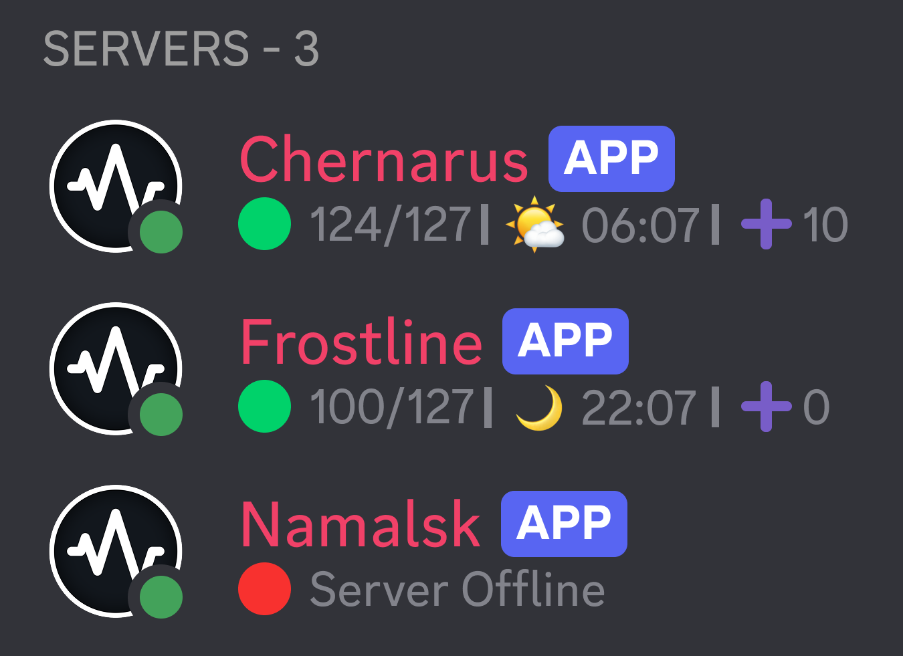

# Discord Bot for Monitoring DayZ Servers
> A simple and effective Discord bot that extracts data from the server in real time via **Query Port**.



### 🚀 Features
- **Multibot support** — run multiple bots at the same time to monitor several servers.
- **Server status** — shows whether the server is online or offline.
- **Player count** — displays the current number of players.
- **Slots** — shows available and occupied slots.
- **In-game time** — displays the current time of day (day/night) on the server.
- **Queue info** — shows how many players are in the queue.
- **Templates** — customize status messages like "🟢 {players}/{slots} | {time} | ➕{queue}"
- **Update interval** — 10 seconds.

### ➕ Customisation
> All bot settings are stored in the **`servers.json`** file in the project root.

```json
[
  {
    "name": "Chernarus",
    "token": "BotToken",
    "ip": "127.0.0.1",
    "query_port": 27017,
    "status_template": "🟢 {players}/{slots} | {time} | ➕{queue}"
  },
  {
    "name": "Livonia",
    "token": "BotToken",
    "ip": "127.0.0.1",
    "query_port": 27018,
    "status_template": "🟢 {players}/{slots} | {time} | ➕{queue}"
  }
]
```

### 🎉 Launch
Run **`start.bat`** or **`QueryMonit.exe`** to start the bot.
